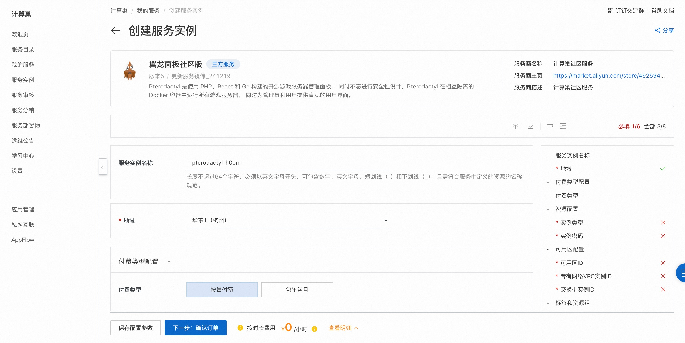
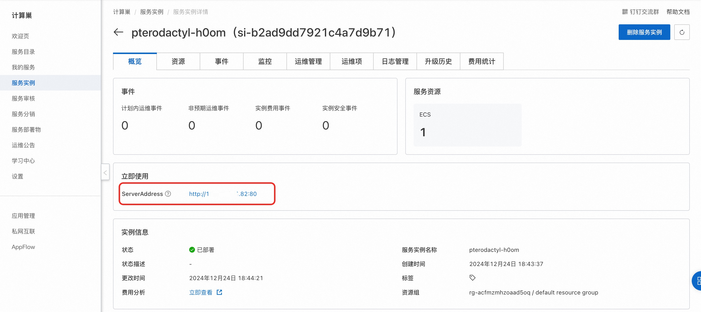
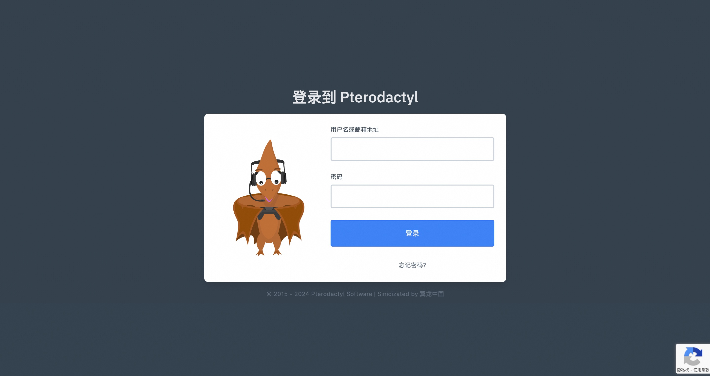
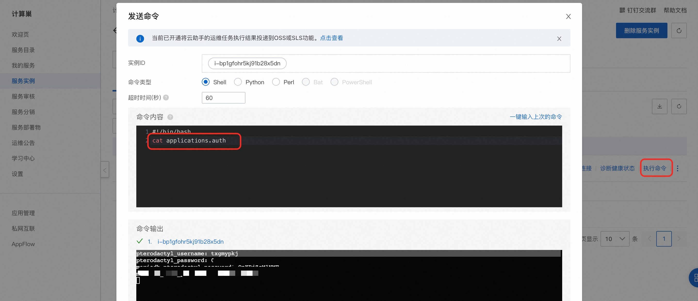

# 快速部署翼龙面板社区版

## 概述

Pterodactyl 是使用 PHP、React 和 Go 构建的开源游戏服务器管理面板。 同时不忘进行安全性设计，Pterodactyl 在相互隔离的 Docker 容器中运行所有游戏服务器， 同时为管理员和用户提供直观的用户界面。

## 计费说明

翼龙面板社区版在计算巢上部署的费用主要涉及：

- 所选vCPU与内存规格
- 磁盘容量
- 公网带宽

计费方式：按量付费（小时）

预估费用在创建实例时可实时看到。

## RAM账号所需权限

翼龙面板社区版需要对ECS、VPC等资源进行访问和创建操作，若您使用RAM用户创建服务实例，需要在创建服务实例前，对使用的RAM用户的账号添加相应资源的权限。添加RAM权限的详细操作，请参见[为RAM用户授权](https://help.aliyun.com/document_detail/121945.html)
。所需权限如下表所示。

| 权限策略名称                          | 备注                         |
|---------------------------------|----------------------------|
| AliyunECSFullAccess             | 管理云服务器服务（ECS）的权限           |
| AliyunVPCFullAccess             | 管理专有网络（VPC）的权限             |
| AliyunROSFullAccess             | 管理资源编排服务（ROS）的权限           |
| AliyunComputeNestUserFullAccess | 管理计算巢服务（ComputeNest）的用户侧权限 |
| AliyunCloudMonitorFullAccess    | 管理云监控（CloudMonitor）的权限     |


## 部署流程
1. 单击[部署链接](https://computenest.console.aliyun.com/service/instance/create/cn-hangzhou?type=user&ServiceName=%E7%BF%BC%E9%BE%99%E9%9D%A2%E6%9D%BF%E7%A4%BE%E5%8C%BA%E7%89%88)，进入服务实例部署界面。
2. 选择新建ECS实例并根据界面提示配置参数，配置完成后点击下一步：确认订单。
    
3. 点击立即创建，等待服务实例创建完成。服务实例创建成功后，进入服务实例概览页。
    
4. 点击服务连接访问面板。
    
5. 执行命令获取账号和密码以登录：
    ```shell
    cat applications.auth
    ```
    
